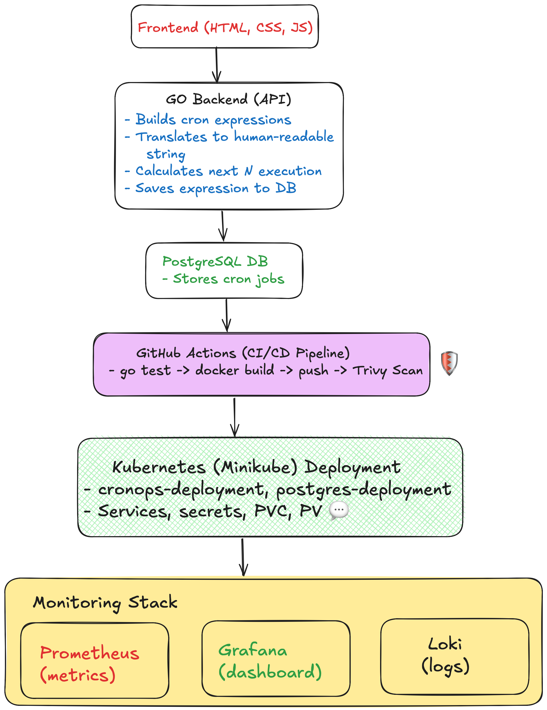
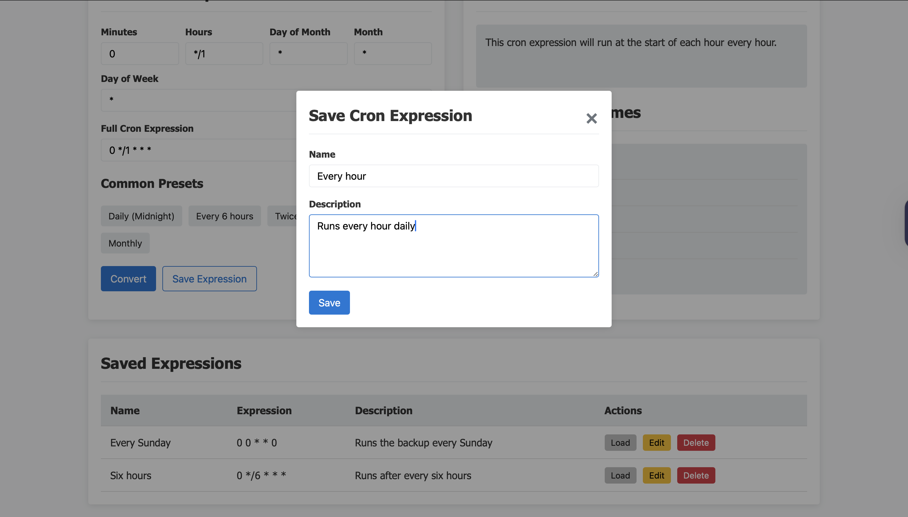
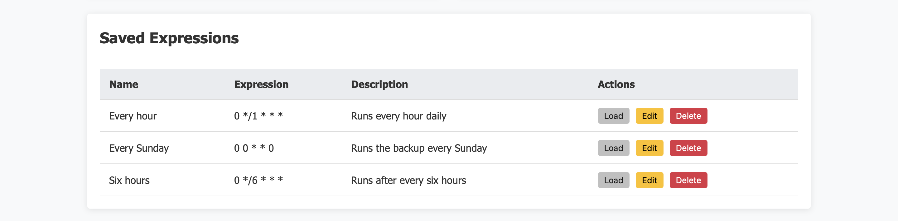
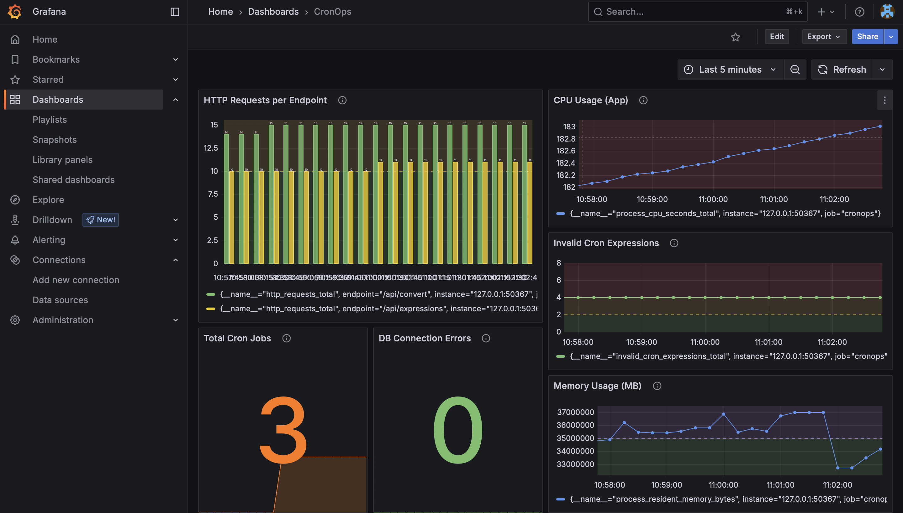

# 🛠️ CronOps – Jenkins Cron Job Manager with CI/CD, K8s & Monitoring ♾️☸️📊

CronOps is a web application that simplifies the creation and management of **Cron Jobs** for Jenkins. Instead of writing raw cron expressions, users can input human-readable scheduling parameters like minute, hour, day, week and month. The backend generates the cron expression, provides a human-readable explanation, and shows upcoming execution times. It’s containerized, production-ready, CI/CD enabled, and observability-focused with Prometheus, Grafana, and Loki.

---

## 📑 Table of Contents

- [Features](#features)
- [Tech Stack](#tech-stack)
- [Project Structure](#project-structure)
- [Architecture](#architecture)
- [Screenshots](#screenshots)
- [CI/CD Pipeline](#cicd-pipeline)
- [Local Setup (Docker)](#local-setup-docker)
- [Kubernetes Setup](#kubernetes-setup)
- [Monitoring](#monitoring)
- [Secrets Management](#secrets-management)
- [Demo](#demo)
- [Author](#author)

---

## ✨ Features

- 🧠 Human-friendly Jenkins cron job builder
- 📝 Generates cron expression, description & execution preview
- 🗄️ Saves jobs with title, description, and schedule
- 📦 Containerized with Docker + Volumes
- ☸️ Kubernetes manifests for production deployment + persistent volumes
- 🔁 GitHub Actions CI/CD pipeline (test → build → push → scan)
- 📊 Real-time monitoring with Prometheus, Grafana, and Loki
- 🔒 Secrets managed via `.env` (local) and Kubernetes Secrets (prod)

---

## 🧰 Tech Stack

| Layer         | Tool / Technology     |
|---------------|------------------------|
| Frontend      | HTML, CSS, JavaScript  |
| Backend       | Go                     |
| Database      | PostgreSQL             |
| Container     | Docker, Docker Compose |
| Deployment    | Kubernetes (Minikube)  |
| CI/CD         | GitHub Actions, Trivy  |
| Monitoring    | Prometheus, Grafana, Loki |
| Security      | Kubernetes Secrets, `.env` |
| Volumes       | Docker & K8s PV/PVC    |

---

## 🗂️ Project Structure

```plaintext
CronOps/
├── cronops-data/                     # Data storage folder
├── docs/                             # Architecture diagram & screenshots
│   ├── architecture.png
│   ├── grafana-dashboard.png
│   ├── screenshot1.png
│   ├── screenshot2.png
│   └── screenshot3.png
├── Kubernetes/                       # Kubernetes manifests
│   ├── cronops-deployment.yaml
│   ├── cronops-service.yaml
│   ├── postgres-deployment.yaml
│   ├── postgres-pv.yaml
│   ├── postgres-pvc.yaml
│   ├── postgres-secret.yaml          # Ignored from Git, for K8s secrets
│   └── postgres-service.yaml
├── static/                           # Frontend (HTML, CSS, JS)
├── .env                              # Environment variables (local use only)
├── .github/                          # GitHub Actions workflows
│   └── workflows/
│       └── deploy.yaml
├── .gitignore                        # Git ignored files
├── cronops.log                       # Application log file (unstaged)
├── docker-compose.yaml               # Docker Compose for local dev
├── Dockerfile                        # Dockerfile for Go backend
├── go.mod                            # Go module dependencies
├── Grafana-dashboard.png             # Dashboard screenshot (updated image exists in docs/)
├── init_db.sql                       # SQL schema init script
├── main.go                           # Entry point of backend
├── main_test.go                      # Unit tests
├── migrations.go                     # Go logic for schema creation

```

---

## 🏗️ Architecture



---

## 📸 Screenshots

  
> Cron expression to run daily every hour

> Saving cron expression to database

> Saved cron expression

---

## ⚙️ CI/CD Pipeline

- **GitHub Actions** pipeline:
  - ✅ Run Go unit tests
  - 🐳 Build Docker image for backend
  - 🚢 Push to DockerHub: [`nsahil992/cronops`](https://hub.docker.com/r/nsahil992/cronops)
  - 🛡️ Scan for vulnerabilities with Trivy

```yaml
# .github/workflows/deploy.yaml
- name: Run the Go tests
- name: Build & Push Docker Image
- name: Trivy Docker image Scanning
```

---
## .env.example
```
DB_HOST=localhost/host.docker.internal/database
DB_PORT=5432 (your db port)
DB_USER=(your db user)
DB_PASSWORD=(your postgres password)
DB_NAME=(your database name)
```

## postgres-secret.example.yaml

```
apiVersion: v1
kind: Secret
metadata:
  name: postgres-secret
type: Opaque
data:
  POSTGRES_USER: anscGdssSE 
  POSTGRES_PASSWORD: c2hsgadafkgsdg== 
  POSTGRES_DB: Y3JvbfasbngnRlcg== 

  # echo -n "your value" | base64
```

---

## 💻 Local Setup (Docker)

```bash
# Clone the repo
git clone https://github.com/nsahil992/CronOps
cd CronOps

# Copy and configure .env
cp .env.example .env

# Start containers
docker compose up --build
```

---

## ☸️ Kubernetes Setup

```
# Apply Postgres manifests first
kubectl apply -f postgres-pvc.yaml -f postgres-secret.yaml -f postgres-service.yaml -f postgres-deployment.yaml -f postgres-pv.yaml -n cronops

# Apply CronOps manifests
kubectl apply -f cronops-deployment.yaml -f cronops-service.yaml -n cronops

```

## 📊 Monitoring

  

Monitoring stack includes:

Prometheus – scrapes /metrics from the Go app
Grafana – visual dashboards for metrics
Loki – central log collection via promtail

```
# Access:
# Prometheus: http://localhost:9090
# Grafana: http://localhost:3000 (default: admin/admin)
# Loki: http://localhost:3100

```

---

## 🔐 Secrets Management


✅ .env is used for local development only and is never committed to GitHub
✅ Kubernetes Secrets are defined in postgres-secret.yaml (base64-encoded)
🔒 You must create secrets locally 

---

## 📽️ Demo

[](https://youtu.be/abcd1234xyz)

> 🔗 Click the image above to watch a 5-minute walkthrough of CronOps in action.

---

## 👤 Author

Sahil – DevOps & SRE enthusiast building useful systems

- [GitHub](https://github.com/nsahil992)
- [LinkedIn](https://linkedin.com/in/nsahil992)

---

⭐ Don’t forget to star this repo if you loved this project!


